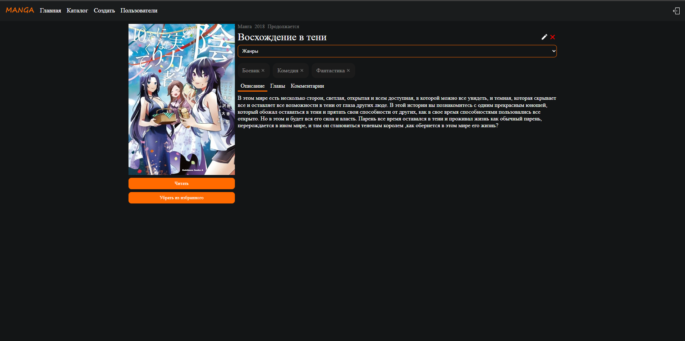
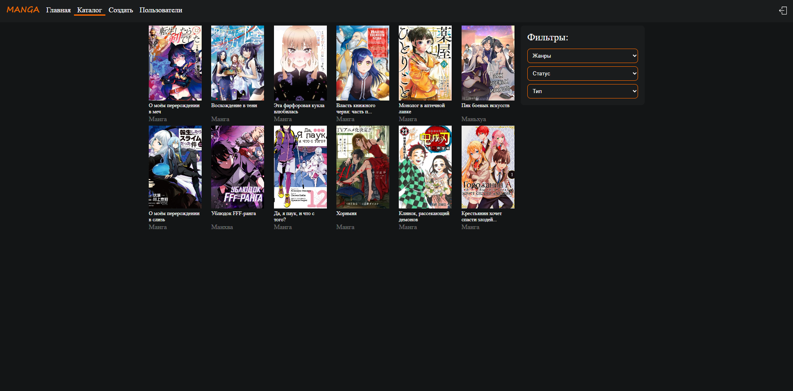
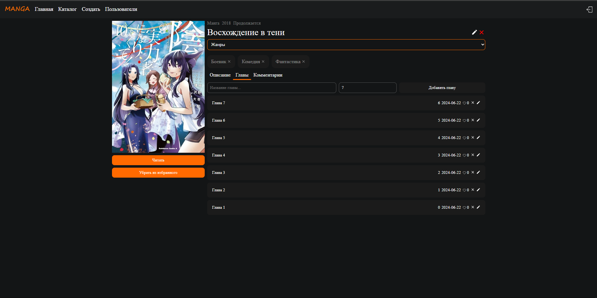
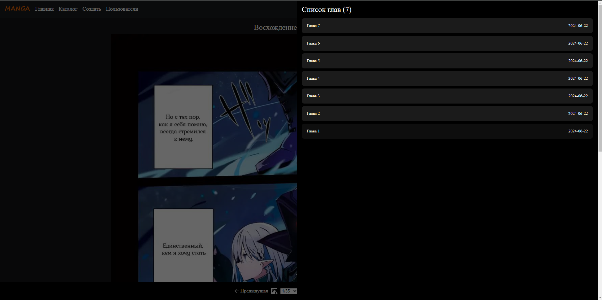
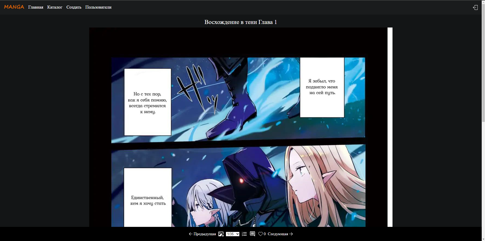
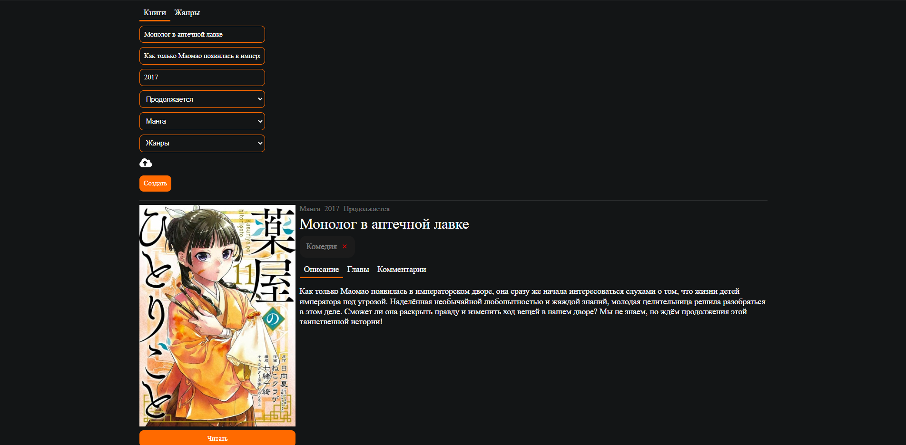
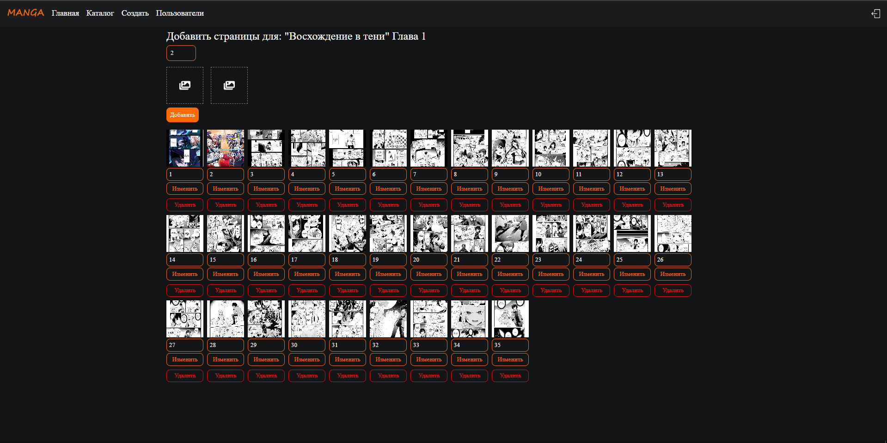
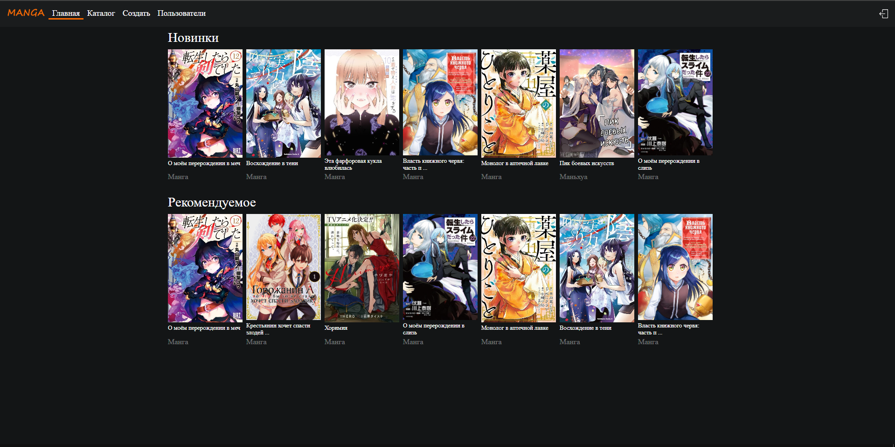

# Read-manga
Online application for easy reading of Manga, Manhwa, Manhua

#### Book page:


#### Catalog page:


#### Chapter book page:


#### Chapter List:


#### Chapter page:


#### Create book:


#### Create page:


#### Main page:



## Installation Guide

### Requirements
- [Nodejs](https://nodejs.org/en/download)
- [PostgreSQL](https://www.postgresql.org/download/)

Both should be installed and make sure postgreSQL is running.

```shell
git clone https://github.com/xkz1899/read-manga.git
cd read-manga
```

Install the dependencies.

```shell
cd server
npm install
cd ../client
npm install
cd ..
```
#### Create a database named "manga" in the database postgreSQL.

#### Start server.

```shell
cd server
npm start
```

#### Start client.

```shell
cd client
npm start
```

Now open http://localhost:3000 in your browser.

The first registered user to receive administrator status.